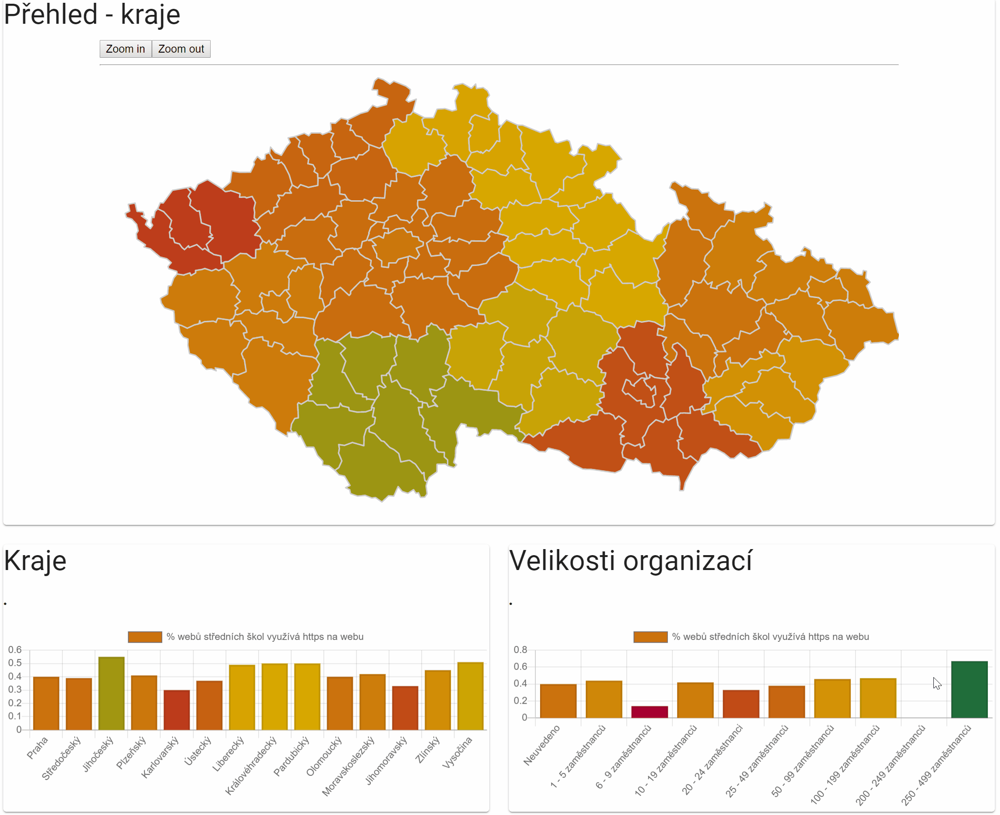

# SchoolCyberSec
Analysis of website security of Czech Secondary Education Facilities

## Overview
This project was created as part of the [Public Sector Hackathon 3.0 in Prague](https://hackujstat.cz/). See the presentation, doc submission and other details about the project development here: https://devpost.com/software/schoolcybersec
<p align="center"> 

</p>


## Datasets used
- ARES by Ministry of Finance
- Czech School Inspectorate data

Output is then processed and fed into GeoJSON for visualizations

## How to deploy and use the demo

Download this source code [or clone the repo](https://github.com/Plavit/HackujStat2019-SchoolCyberSec)


Once you have downloaded the example install the dependencies and run the app.

```bash
npm install
npm run dev
```
